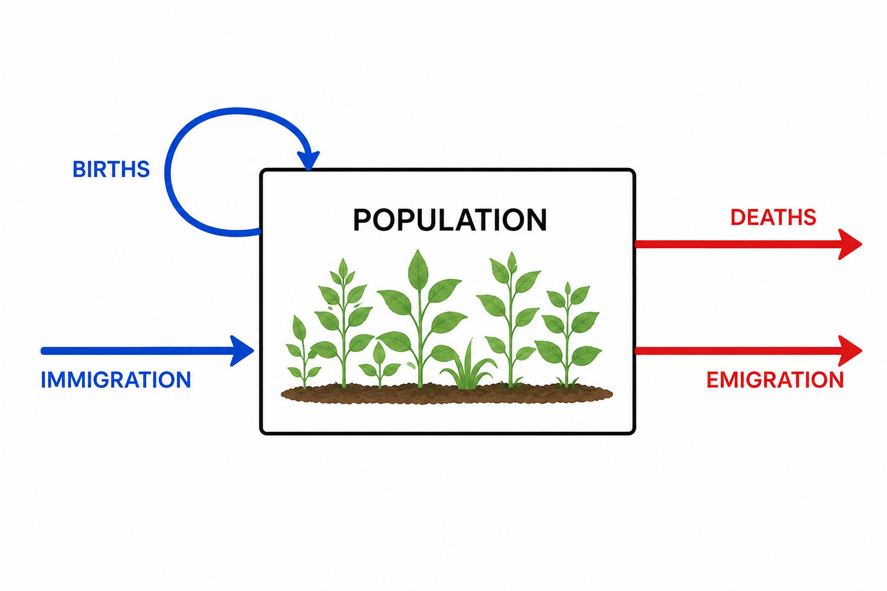
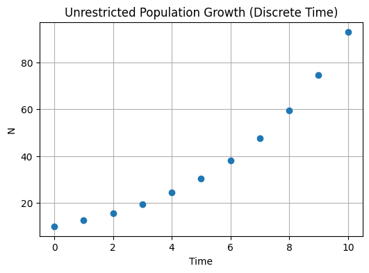
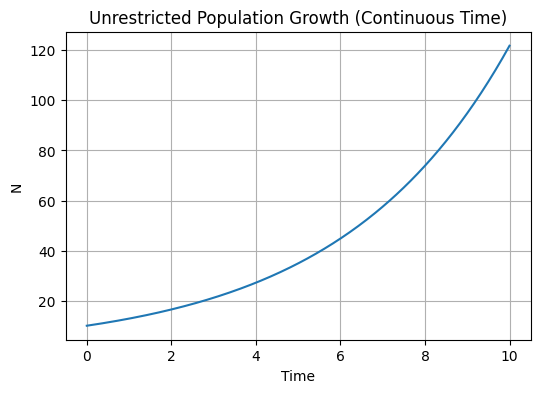

```{r setup, include=FALSE}
knitr::opts_chunk$set(echo = TRUE)
library(rstudioapi)
current_path <- getActiveDocumentContext()$path 
setwd(dirname(current_path)) # set working directory to location of this file
```

## Learning objectives

1. Understand basic processes influencing population size
2. Plot population sizes over time wiht different growth rates
3. Model a population with discrete and continuous time

## Factors influencing population size

*in most basic from, population size is determined by births, deaths, immigration, and emigration*



*births are a feedback loop because births are coming from the population*

*we are most interested in population dynamics over time*

* understand causes of variation
* predict population sizes across space and time *what sort of data do we need to do this?*
* data: time series *most basic is tracking population sizes over time*

*model depends on how we are measuring time*

## Terminology and variables in population models

* discrete time - divide into time steps (e.g. year), difference equation
* continuous time - differential equation

*we'll mostly work with discrete time*

*relate to Kezia's statistics class- geometric distribution for discrete response variables, exponential distribution for continuous response variables, but very similar*

* N = population size
* t = time 
* per capita = per individual

* $N_t$ = population at t 

*$N_{t+1}$ is size in next year*

* $\lambda$ = per capita growth rate (discrete, geometric)

* dN/dt = rate of change in population size
* r = intrinsic growth rate (continuous, exponential)

## Models

### Discrete time with geometric growth

$$ N_{t+1} = \lambda N_t $$

* $\lambda$ = 1, population growth is constant
* $\lambda$ < 1, population decline
* $\lambda$ > 1, population growth

*we can rearrange this equation so we get population at any t*

$$ N_T = N_0\lambda^T $$

*$N_0$ is initial population size*

*with that exponent, looks more like unrestricted growth like what we would expect*



### Continuous time with exponential growth

$$ \frac{dN}{dt} = rN(t) $$

* r = 0, change in population size is 0
* -r, population decline
* +r, population growth

$$ N(T) = N(0)e^{rT} $$



*in real populations, births, deaths, immigration, emigration aren't constant*

*so population sizes over time aren't nice continuous*

## Demographic stochasticity

* variation due to chance events affecting individuals
* birth/death rates in diagram are an average
* model: per capita growth rate comes from a distribution *e.g. lambda is uniform distribution between 0.5 and 1.5*
* increases extinction risk in small populations *because if by chance reproductive individuals have few offspring for a few years, population could go extinct*

### Geometric vs. arithmetic growth

*given that lambda fluctuates year to year, what if you wanted to get the average population growth rate?*

*lambda is per capita population growth rate, so we need average lambda*

*exponential-looking relationship makes it confusing when we're trying to get population growth rate*

* average population growth rate = mean(LOG($\lambda$))
* geometric mean
* log(mean($\lambda$)) = arithmetic mean *can overestimate population growth*
