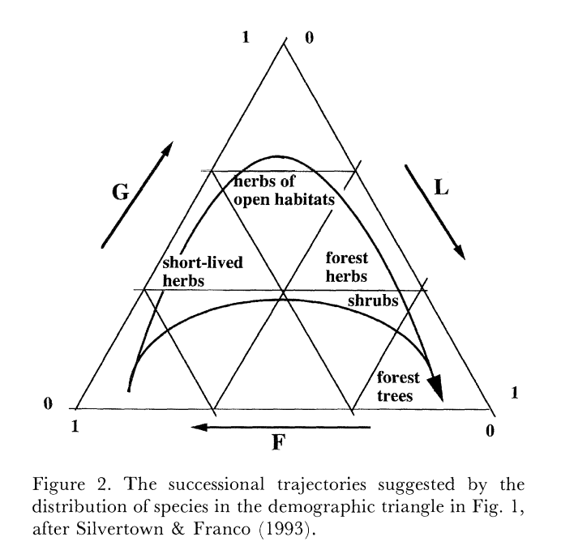
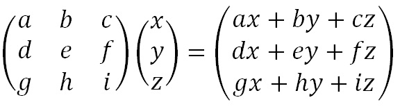

```{r setup, include=FALSE}
knitr::opts_chunk$set(echo = TRUE)
library(rstudioapi)
current_path <- getActiveDocumentContext()$path 
#setwd(dirname(current_path)) # set working directory to location of this file
```

## Learning objectives

1. Understand how and why growth, survival, and fecundity trade off
2. Do sensitivity and elasticity analyses

*review of last lecture: life tables and structured populations. How do we compare species with different life history strategies?*

*analyze structured populations by manipulating elements of the matrix (vital rates)*


## Tradeoffs

*limited amount of energy and resources - need to decide how to allocate to growth, survival, reproduction*

*most basic tradeoff is the r-K theory*

### r-K

* r species - fast growth *r*, many offspring, low investment
* K species - slow growth, near carrying capacity, few offspring, high investment
* **caveats** - binary instead of spectrum, generalization *example, trees like oaks that are long-lived but produce loads of acorns with low investment per acorn defy this theory*

### Demographic triangle

* growth, stasis, fecundity



* can't optimize all three

## Analyzing structured populations

### (skip this?) Population projection

*we can also project the abundances of each age in a given time step*

* multiply: Leslie matrix, matrix of N at t
* product: matrix of N at t+1

*quick refresher of matrix math*



```{r}
leslie <- c(0,0.2,0,0,0,0.25,100,0,0)
Nt <- c(1000, 200, 50)

leslie.mat <- matrix(leslie,nrow=3,ncol=3)
leslie.mat

N.mat <- matrix(Nt,nrow=3,ncol=1)
N.mat

leslie.mat %*% N.mat
```

### Elasticity analyses

*let's say you have rare plant population data. population growth rate is less than 1, declining, but you don't know why. Is it survival or reproduction issue?*

* quantify influence of vital rates on $\lambda$
* proportional change in growth rate

*not absolute change in population growth rate, use sensitivity analysis for that*

### Sensitivity analyses

*let's say you could actually improve the survival of the population. Sensitivity analysis tells you how much the population growth rate would increase if you increased survival rate*

* stage/age specific *increase survival of adults, juveniles, etc*
* repeatedly compute population growth rate
