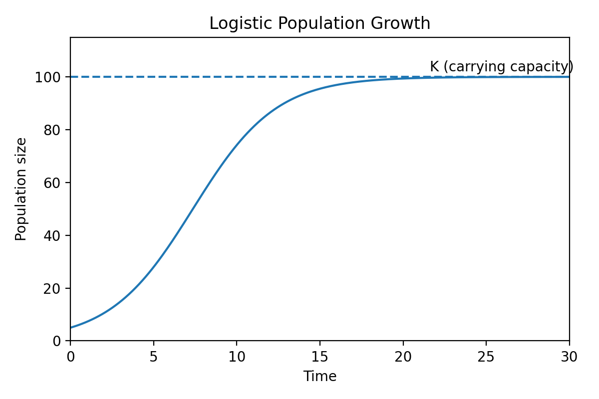

```{r setup, include=FALSE}
knitr::opts_chunk$set(echo = TRUE)
library(rstudioapi)
current_path <- getActiveDocumentContext()$path 
#setwd(dirname(current_path)) # set working directory to location of this file
```

## Learning objectives

1. Understand how resource and space limitation and natural enemies affect population growth
2. Model density dependence with continuous time using a logistic model
3. Model density dependence with discrete time using a Beverton-Holt model and Ricker model

*review of last lecture: structured populations, but population growth rate wasn't affected by abundance in any stage*

*now we're adding density dependence, population growth depends on abundance*

## Density-dependent processes

*why would the number of individuals affect the growth of the population?*

### Resource limitation

* shared pool of resources *light, water, nutrients*
* as resource availability decreases, population growth decreases
* example: self-thinning
  + population size increases
  + intercept light from seedlings
  + seedling mortality increases

### Space limitation

* can be independent of resource availability
* example: lateral growth *in tightly packed forests*, windthrow from belowground constraints

### Natural enemies 

* herbivores, pathogens, seed predators
* as population size increases, attracts herbivores and predators, susceptible to disease
* survival decreases, back to equilibrium

*start with continuous time since more familiar: logistic equation*

## Logistic equation - continuous time

* r = intrinsic growth rate *same as r from first lecture, continuous time*
* K = carrying capacity *equilibrium abundance*

$$ \frac{dN}{dt} = rN(1-\frac{N}{K}) $$

*change in population size over time is rN, what we saw before*

*now limited by carrying capacity, so if N = K, no change in size*



### K vs. $\alpha$

*K comes from early population ecology in fisheries, less useful to us*

*in plant populations, more interested in that $\alpha$ for determing strength of density dependence and competition*

$$ \alpha = \frac{r}{K} $$

$$ \frac{dN}{dt} = N(r-\alpha{N}) $$

*population size at time t = population size times the intrinsic growth rate minus density dependence*

*now let's go into some models for discrete time, which we'll play with in the lab and can be more common for analysis*

*two different models: Beverton-Holt and Ricker*

## Beverton-Holt model - discrete time

* $\lambda$ - population growth rate
* $\alpha$ - phenomenological competition *strength of competition between conspecifics*

$$ N_{t+1} = \frac{\lambda N_t}{1+\alpha N_t} $$

*again $\lambda$N is that unrestricted population growth, but now it's limited by abundance with the competition scalar*

## Ricker model - discrete time

* same variables

$$ N_{t+1} = \lambda N_t e^{-\alpha N_t} $$


