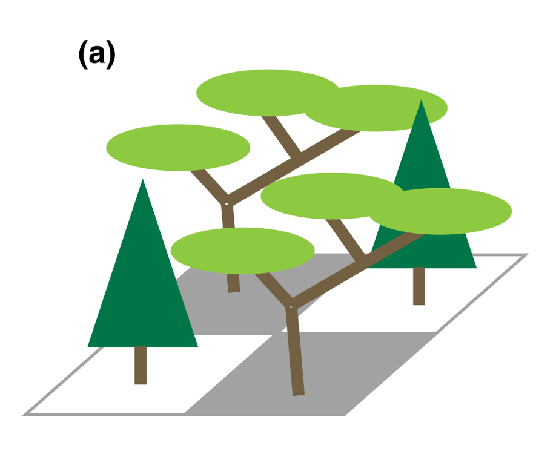
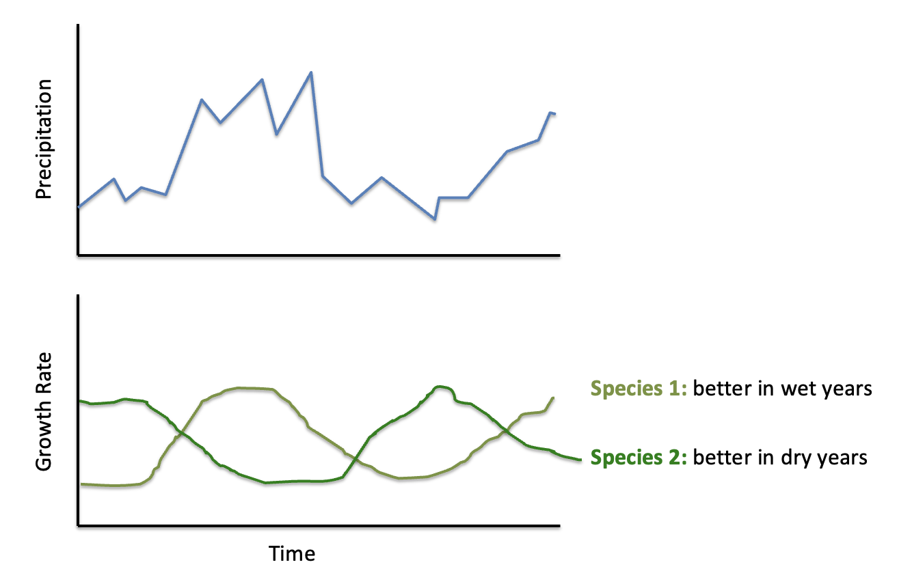
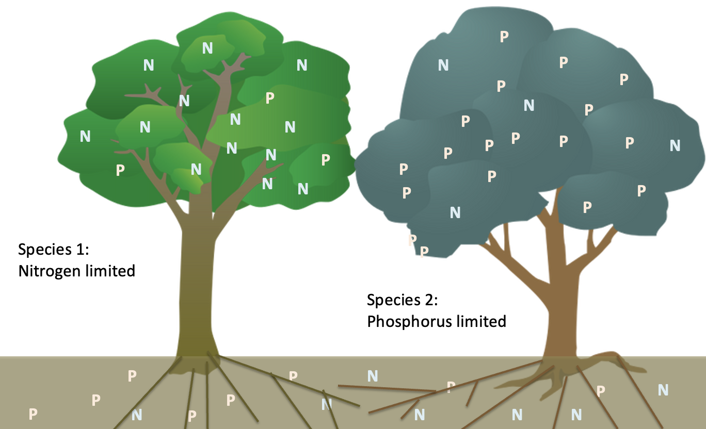

```{r setup, include=FALSE}
knitr::opts_chunk$set(echo = TRUE)
library(rstudioapi)
current_path <- getActiveDocumentContext()$path 
#setwd(dirname(current_path)) # set working directory to location of this file
```

## Learning objectives

1. Know the processes that lead to species coexistence
2. Add a competitor to the Beverton-Holt model
3. Perform an invasion analysis

## Competition and coexistence

### Interspecific competition and its outcomes

* interspecific competition: one species has reduced growth rate in presence of another species
* outcomes:
  + competitive exclusion - one species outcompetes other species
  + coexistence - stabilize and both persist in long term *may have lower population growth or sizes compared to those without competitor, but if they persist, it's coexistence*
  + priority effects - depends on species arrival *whichever arrives in the community first*

*given that species compete with each other, how do you get diverse communities where many species coexist?*

### Processes leading to stable coexistence

* spatial heterogeneity - good and bad patches



* temporal heterogeneity - good years and bad years



* resource partitioning - limited by different resources



* natural enemies - host-specific *talk about this in week 8* 


*species is limiting itself more than others- this makes sense because if multiple species are going to coexist, we can't have a species that has unrestricted growth, it'll just use up all the resources*

* intraspecific competition > interspecific competition

## Modeling interspecific competition

*add to beverton-holt, previously:*

$$ N_{i,t+1} = \frac{\lambda N_{i,t}}{1+\alpha_{ii} N_{i,t}} $$

*add a second species to restrict population growth*

* species i and j
* $\alpha_{ij}$ = effect of j on i

$$ N_{i,t+1} = \frac{\lambda N_{i,t}}{1+\alpha_{ii}N_{i,t}+\alpha_{ij}N_{j,t}} $$

*we just added another term in the denominator, added subscripts to clarify which population we're modeling*

## Invasion analyses

*I said you have coexistence when both persist in long term*

*but a time series of populations alone can't tell you if there's coexistence*

*plot example with 2 populations fluctuating over time*

*this looks like coexistence, but what if transient dynamics, decline in future?*

* both species increase from low density
* long-term average population growth rate
* $log \frac{N_{t+1}}{N_t}$ > 0 for each species - coexistence, < 0 competitive exclusion


