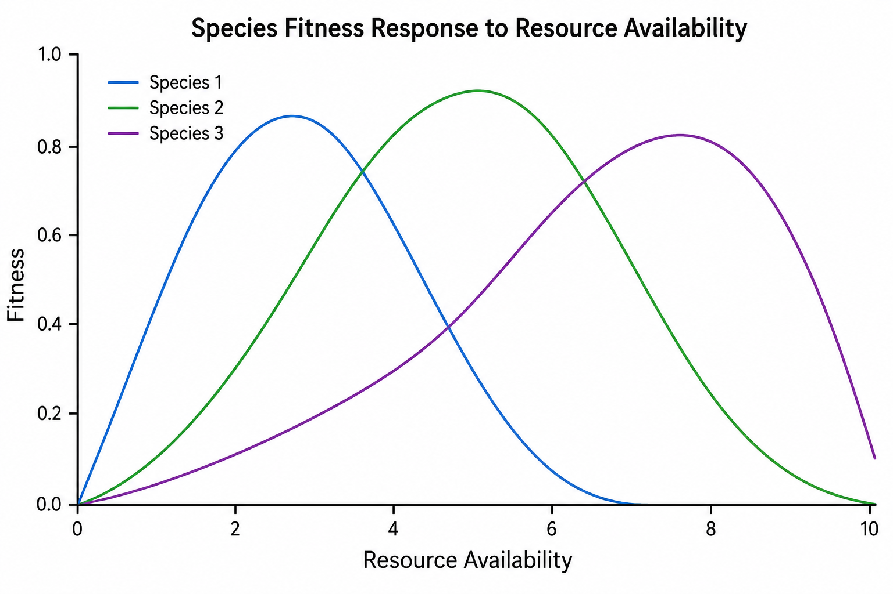

```{r setup, include=FALSE}
knitr::opts_chunk$set(echo = TRUE)
library(rstudioapi)
current_path <- getActiveDocumentContext()$path 
#setwd(dirname(current_path)) # set working directory to location of this file
```

## Learning objectives

1. Understand how resource availability affects coexistence
2. Know the strengths and limitations of Tilman's R* theory and MacArthur's consumer resource model

*last lecture: phenomenological competition model, only effects, not actual resource levels*

## Resource competition and diversity

*talked about mechanisms of diversity maintenance, but didn't model any mechanisms or processes*

* optimal resource or level varies by species
* environmental heterogeneity creates resource variability



* niche overlap *color in overlap in distribution*

### Neutral theory

*because we've talked about niche theory, I'll also mention neutral theory*

* assumes all species equal in response to resources
* diversity maintained from speciation and stochastic extinction

## Modeling resource competition

### Tilman's R* theory

* R* = amount of resource a species needs to maintain equilibrium
* if R* of species 1 < R* of species 2 for same resource, species 2 excluded
* 2 resources - stable coexistence if 
  + limited by different resources
  + consume more of that limited resource than other species
* assumptions: constant resources, equilibrium

*related to intraspecific competition > interspecific competition - species self-limit*

### MacArthur's consumer-resource model

* model consumer and resource density *traditionally for predator-prey dynamics*
* attack rates = consumption
* multiple resources and consumers
* assumptions: consumer abundance $\le$ resource abundance


